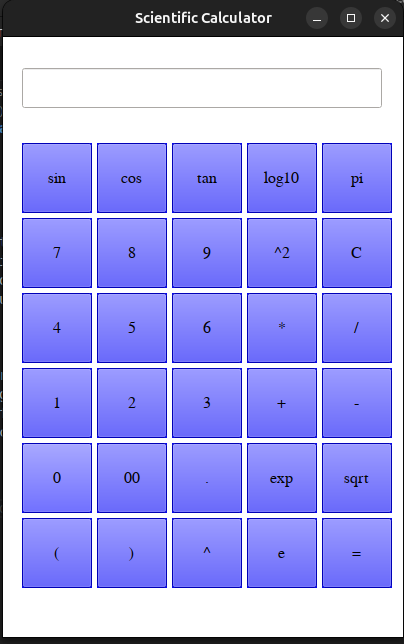

# Octave_scientific_calculator

1.How to Use:

    1.Save this code to a .m file (e.g., scientific_calculator.m).
    2.Run the script in Octave by typing scientific_calculator in the Octave command window.
    3.Click buttons to input expressions or type directly into the text box.
    4.Press = to evaluate the expression.

2.Some issues:
    1.sqrt means square root.
    2.to calculate angles in radians should use pi conversion.
    3.(^2) is square function.
    4.when error is occured , remove error string on text box and enter again.
    

Screenshot of octave:
    

# some function still not added